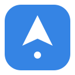
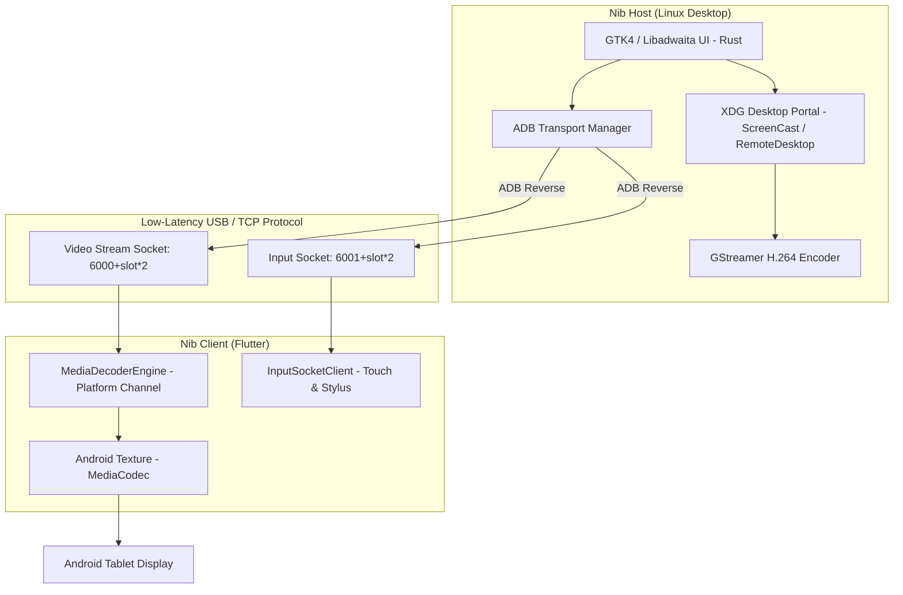

<p align="center">
  
</p>

<h1 align="center">Nib</h1>

<p align="center">
  <a href="https://github.com/vicajilau/nib/actions/workflows/ci.yml">
    
  </a>
  <a href="LICENSE">
    
  </a>
</p>

**Nib** is an open-source desktop extension designed for use with **GNOME**. It turns an **Android tablet or phone** into a low-latency external secondary display with full touch, gesture, and active stylus support.

Written in **Rust**, **GTK4**, and **Libadwaita** on the desktop side, with a **Flutter** companion app on the device side, Nib provides a native, seamless experience adhering to the GNOME Human Interface Guidelines (HIG).

> **Status:** Android is fully functional today (video streaming, touch, gestures, stylus). The iOS/iPadOS client is scaffolded but the native video decoder (VideoToolbox) isn't implemented yet — see [Building & Running](#building--running).

---

## Key Features

- **Low-latency video streaming**: Hardware-accelerated H.264 encoding on the host (VA-API / NVENC, with a software fallback) decoded via Android's `MediaCodec` on the device.
- **Concurrent multi-device support**: Connect several tablets/phones at once without port collisions, using deterministic port-pair allocation (`6000 + slot * 2` for video, `6001 + slot * 2` for input).
- **Automatic device classification**: Detects whether a connected Android device is a tablet or a phone (`tablet-symbolic` vs `phone-symbolic`) by querying its market name and physical aspect ratio over ADB.
- **Gestures & stylus handling**:
  - 1-finger tap/drag: left click and window selection.
  - 2-finger tap: right click (context menu).
  - 2-finger swipe: smooth 2-axis scrolling.
  - 3-finger swipe: GNOME Workspaces & Overview.
  - Active stylus: pressure and tilt data for Krita, GIMP, and Inkscape.
- **Libadwaita toast notifications** for real-time feedback (portal cancellation, connection events, etc.).

---

## Architecture



### 1. Host application (Linux)

* **Language:** Rust
* **UI framework:** GTK4 & Libadwaita (`gtk4-rs`, `libadwaita-rs`)
* **Display server & portals:** Wayland / Mutter via `org.freedesktop.portal.ScreenCast` and `RemoteDesktop`
* **Video pipeline:** GStreamer (`gstreamer-rs`) with VA-API / NVENC H.264 encoding
* **Input injection:** Freedesktop RemoteDesktop portal (`ashpd`) — no raw `uinput` access needed

### 2. Client application (`nib_client`)

* **Framework:** Flutter (Dart)
* **Android:** Kotlin plugin using `MediaCodec` + `SurfaceTexture` — implemented and working
* **iOS / iPadOS:** Swift plugin using `VideoToolbox` + `CVPixelBuffer` — planned, not yet implemented (contributions welcome)
* **Protocol:** Low-overhead TCP binary protocol

---

## Distribution & Packaging (Flathub)

To deliver a zero-setup, plug-and-play experience:

- **Flatpak packaging** (`dev.victorcarreras.Nib.json`): bundles the `adb` binary directly inside the sandbox, so users can install Nib from **GNOME Software** without installing the Android SDK.
- **Wi-Fi / LAN fallback**: direct TCP connection over Wi-Fi, without USB debugging or a cable.

---

## Getting Started

Nib talks to your Android device over ADB, so USB debugging has to be enabled once before the first connection:

1. On the Android device, open **Settings → About phone/tablet** and tap **Build number** 7 times to unlock Developer Options.
2. Go to **Settings → System → Developer options** and enable **USB debugging**.
3. Connect the device to your computer with a USB cable.
4. Accept the **"Allow USB debugging?"** prompt that appears on the device (check **"Always allow from this computer"** to skip it next time).
5. Launch Nib on the desktop — the device should appear in the device list, ready to stream.

Prefer not to use a cable? Once the host and the Flutter client are both running on the same network, you can connect over Wi-Fi/LAN instead (see [Distribution & Packaging](#distribution--packaging-flathub)).

---

## Building & Running

### Host app (Linux)

#### Prerequisites
```bash
# Ubuntu / Debian
sudo apt install cargo rustc libgtk-4-dev libadwaita-1-dev libgstreamer1.0-dev libpipewire-0.3-dev adb

# Fedora
sudo dnf install cargo rust-compiler gtk4-devel libadwaita-devel gstreamer1-devel pipewire-devel android-tools
```

#### Run host
```bash
cargo run
```

### Client app (Android)

```bash
cd nib_client

# Run on a connected Android device / emulator
flutter run

# Build a release APK
flutter build apk --release
```

### Client app (iOS)

The Flutter project builds for iOS, but there is no native video decoder yet — the app will connect but won't display video. If you'd like to help implement the `VideoToolbox`/`CVPixelBuffer` decoder plugin, see `nib_client/ios/Runner/AppDelegate.swift` and the Android equivalent in `nib_client/android/app/src/main/kotlin/dev/victorcarreras/nib/MainActivity.kt` for the platform-channel contract to match.

---

## License

GPL-3.0-or-later. Designed for use with the GNOME desktop.
