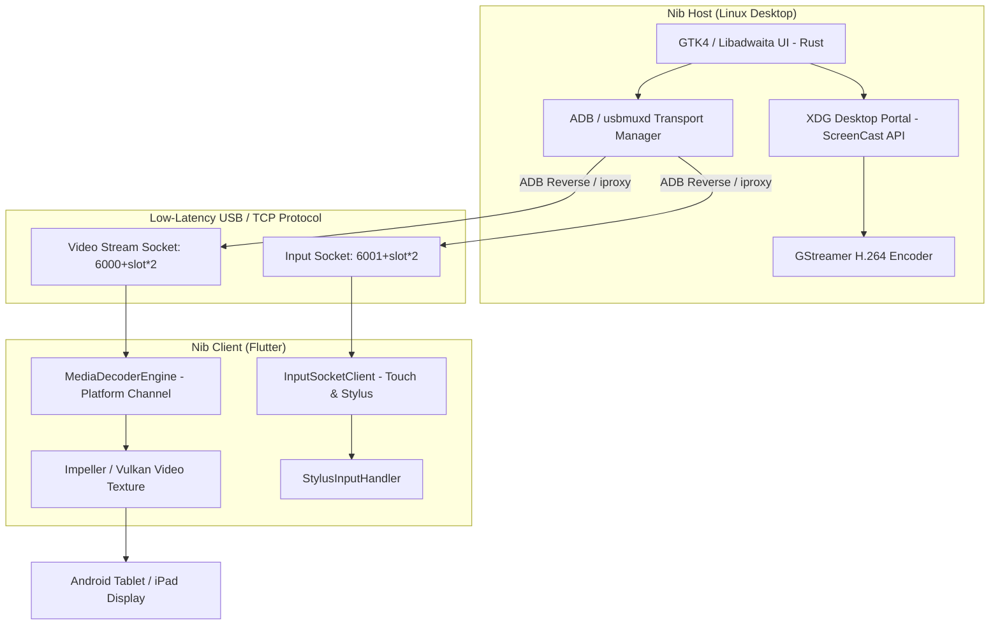

# Nib 📱💻

**Nib** is an open-source, high-performance desktop extension designed for use with **GNOME**. It transforms **Android tablets/smartphones** and **Apple iPads/iPhones** into low-latency external secondary displays with full touch, gesture, and active stylus/pencil support.

Written in **Rust**, **GTK4**, **Libadwaita**, and **Flutter**, Nib provides a native, seamless experience adhering to official GNOME Human Interface Guidelines (HIG).

---

## 🌟 Key Features

- **Multiplatform Client (`nib_client`)**: Single cross-platform Flutter codebase supporting both Android and iOS/iPadOS devices.
- **Hardware-Accelerated Zero-Copy Video Decoding**:
  - **Android**: `MediaCodec` + `SurfaceTexture` via Kotlin Platform Channels.
  - **iPadOS / iOS**: `VideoToolbox` (`VTDecompressionSession`) + `CVPixelBuffer` via Swift.
- **Concurrent Multi-Device Support**: Connect multiple tablets/phones simultaneously without port collision using deterministic port-pair allocation (`6000 + slot * 2` for video, `6001 + slot * 2` for input).
- **Accurate Commercial Device & Icon Detection**: Automatically classifies connected hardware into tablets or smartphones (`tablet-symbolic` vs `phone-symbolic`) by querying market names (`ro.product.marketname`) and physical aspect ratios.
- **Advanced Gestures & Stylus Handling**:
  - 1-Finger Tap/Drag: Left click and window selection.
  - 2-Finger Tap: Right click (context menus).
  - 2-Finger Swipe: Smooth 2-axis scrolling.
  - 3-Finger Swipe: Triggers native GNOME Workspaces & Overview.
  - Active Stylus / Apple Pencil: Sub-pixel precision with pressure and tilt data for Krita, GIMP, and Inkscape.
- **Libadwaita Toast Notifications**: Non-intrusive floating toasts (`adw::ToastOverlay`) for real-time user feedback (e.g., portal cancellation, connection events).

---

## 🏗️ Architecture Stack



### **1. Host Application (Linux)**
* **Language:** Rust (`1.75+`)
* **UI Framework:** GTK4 & Libadwaita (`libadwaita-rs`, `gtk4-rs`)
* **Display Server & Portal:** Wayland / Mutter via `org.freedesktop.portal.ScreenCast`
* **Video Pipeline:** GStreamer (`gstreamer-rs`) with VA-API / NVENC H.264 encoding
* **Input Injection:** Linux `uinput` (`evdev-rs`)

### **2. Client Application (`nib_client`)**
* **Framework:** Flutter (Dart)
* **Android Plugin:** Kotlin (`MediaCodec` + `SurfaceTexture`)
* **iOS / iPadOS Plugin:** Swift (`VideoToolbox` + `CVPixelBuffer`)
* **Protocol:** Low-overhead TCP binary protocol

---

## 🔌 Distribution & Packaging Strategy (Flathub)

To deliver a **Zero-Setup "Plug & Play"** user experience:

- **Flatpak Packaging (`dev.victorcarreras.Nib.json`)**: Bundles the lightweight `android-tools` (`adb`) and `usbmuxd` (`iproxy`) utilities directly inside the sandbox container. Users can install Nib with one click from **GNOME Software** without installing the Android SDK.
- **Wi-Fi / LAN Network Fallback**: Allows direct TCP IP connection over Wi-Fi without requiring USB Debugging or physical cables.

---

## 🚀 Building & Running

### Host App (Linux)

#### Prerequisites
```bash
# Ubuntu / Debian
sudo apt install cargo rustc libgtk-4-dev libadwaita-1-dev libgstreamer1.0-dev libpipewire-0.3-dev adb

# Fedora
sudo dnf install cargo rust-compiler gtk4-devel libadwaita-devel gstreamer1-devel pipewire-devel android-tools
```

#### Run Host
```bash
cargo run
```

### Client App (Android & iPadOS)

```bash
cd nib_client

# Run on connected Android device / emulator
flutter run

# Build release APK
flutter build apk --release
```

---

## 📄 License

GPL-3.0-or-later. Designed for use with the GNOME desktop.
